# インポートからクラスター生成までのフロー

wagriファイルのインポートからクラスター計算までの一連の処理フローを説明する。

## アーキテクチャ概要

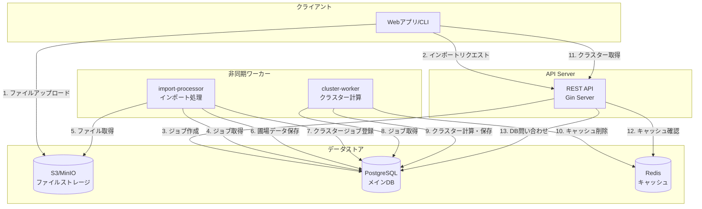

## 処理フロー詳細

### 1. インポートリクエスト〜ジョブ登録

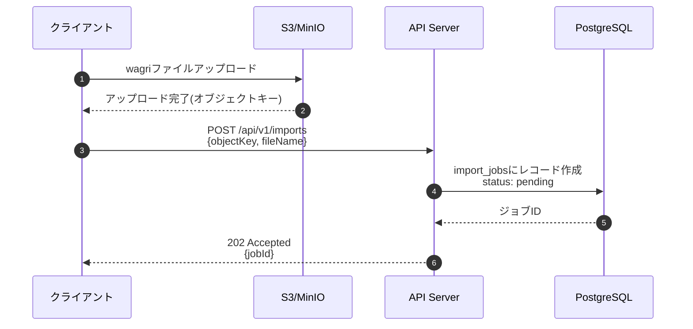

### 2. インポート処理(import-processor)

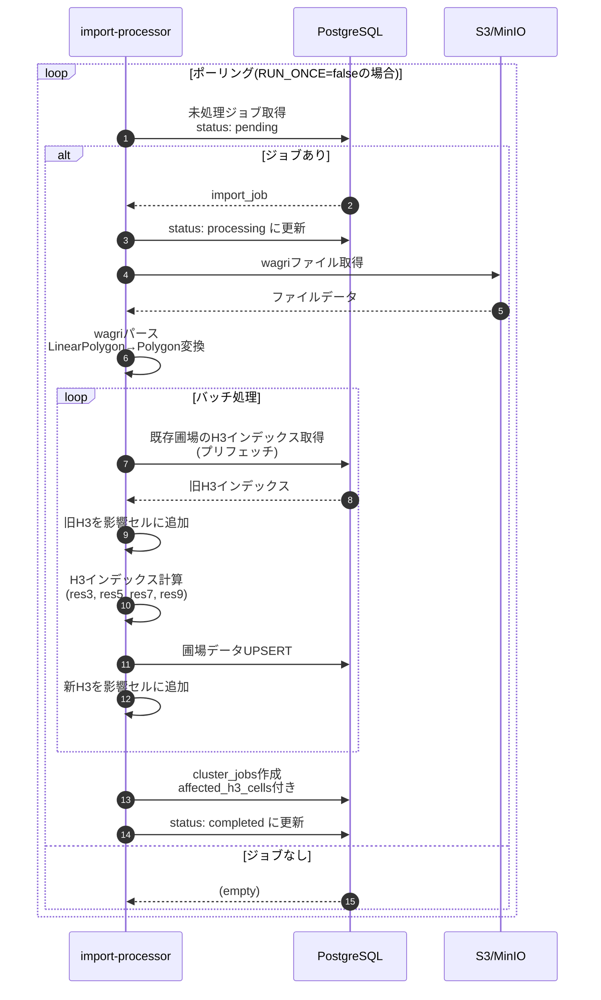

### 3. クラスター計算(cluster-worker)

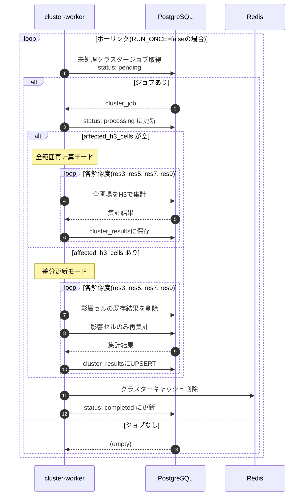

### 4. クラスター取得API

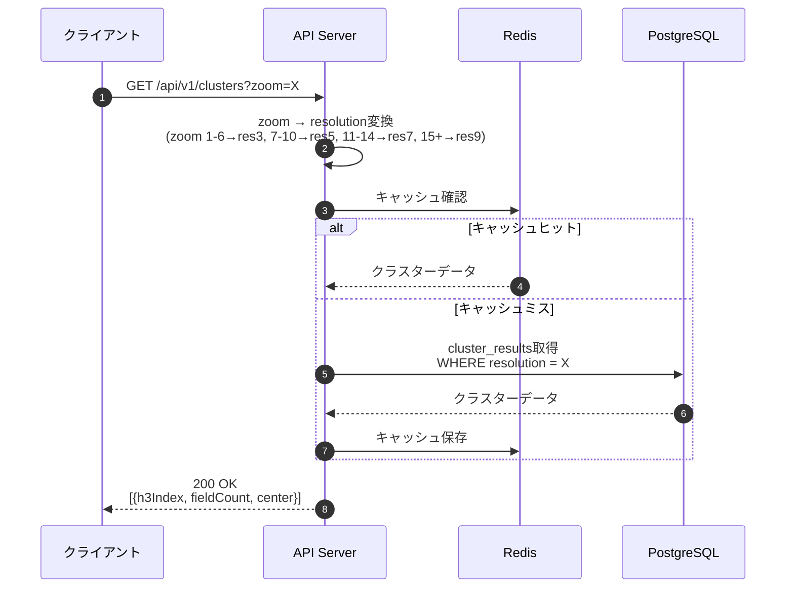

## H3インデックスと解像度

### 解像度とズームレベルの対応

| ズームレベル | H3解像度 | セル面積(概算) | 用途 |
|-------------|---------|---------------|------|
| 1-6 | res3 | ~12,000 km² | 国/地方レベル |
| 7-10 | res5 | ~250 km² | 都道府県レベル |
| 11-14 | res7 | ~5 km² | 市区町村レベル |
| 15+ | res9 | ~0.1 km² | 地区レベル |

### H3インデックス計算フロー

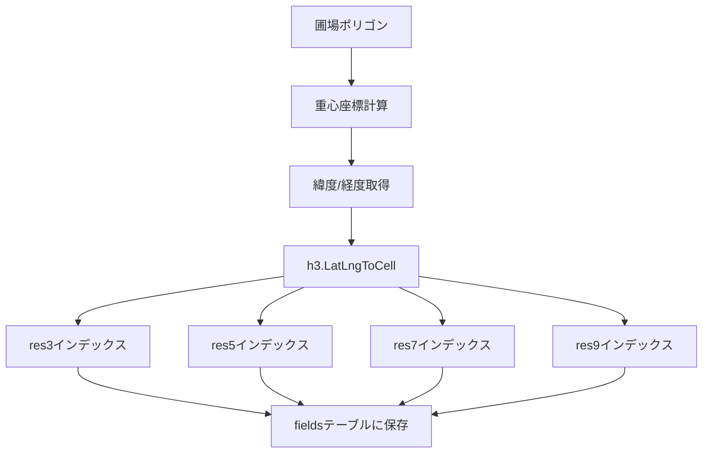

## 差分更新の仕組み

### 影響セル収集

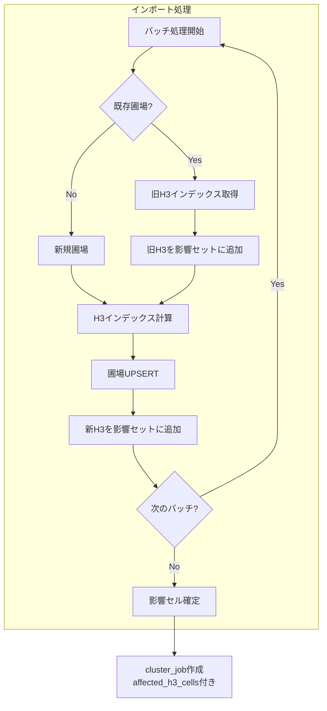

### 差分計算 vs 全範囲計算

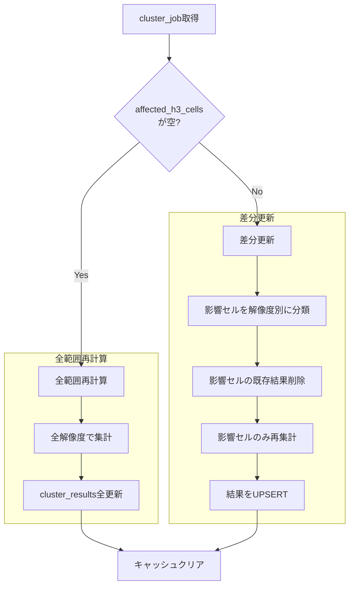

## トランザクション管理

### トランザクション境界の概要

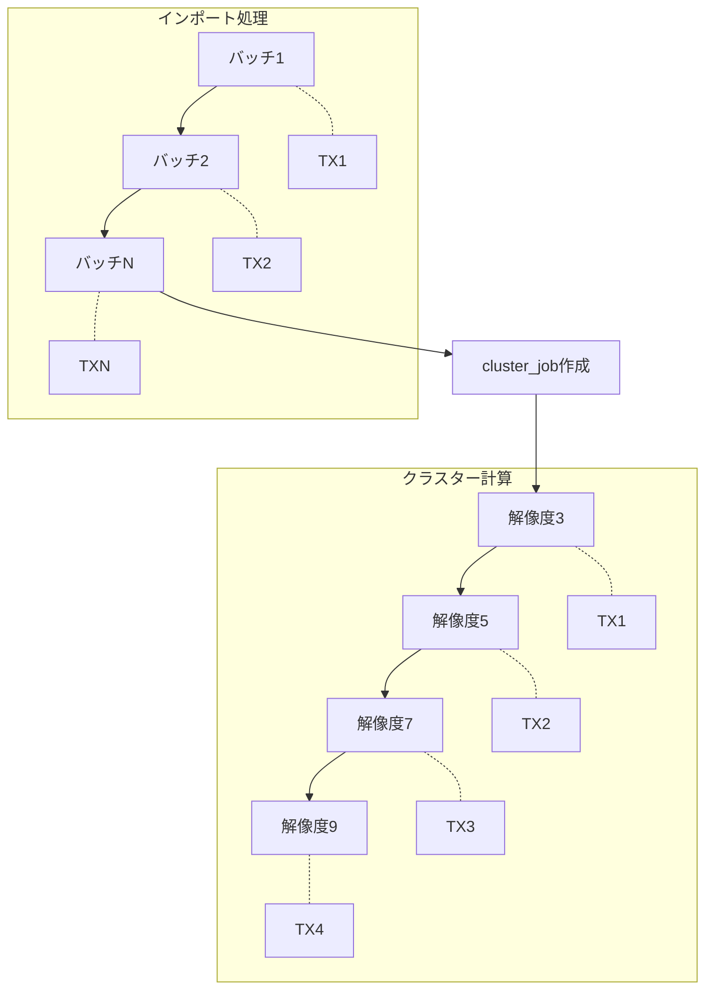

### 処理別トランザクション詳細

| 処理 | トランザクション | 範囲 | 失敗時の挙動 |
|-----|----------------|-----|------------|
| 圃場バッチUPSERT | あり | 1バッチ(複数圃場) | バッチ全体ロールバック、他バッチは継続 |
| クラスター結果保存 | あり | 1解像度分の全クラスター | 解像度全体ロールバック |
| ジョブステータス更新 | なし(単一クエリ) | 1レコード | 自動コミット |
| H3集計クエリ | なし(単一クエリ) | - | 自動コミット |
| キャッシュ削除 | なし(Redis操作) | - | ログ出力のみ、処理継続 |

### 圃場バッチUPSERT(field.go:68-205)

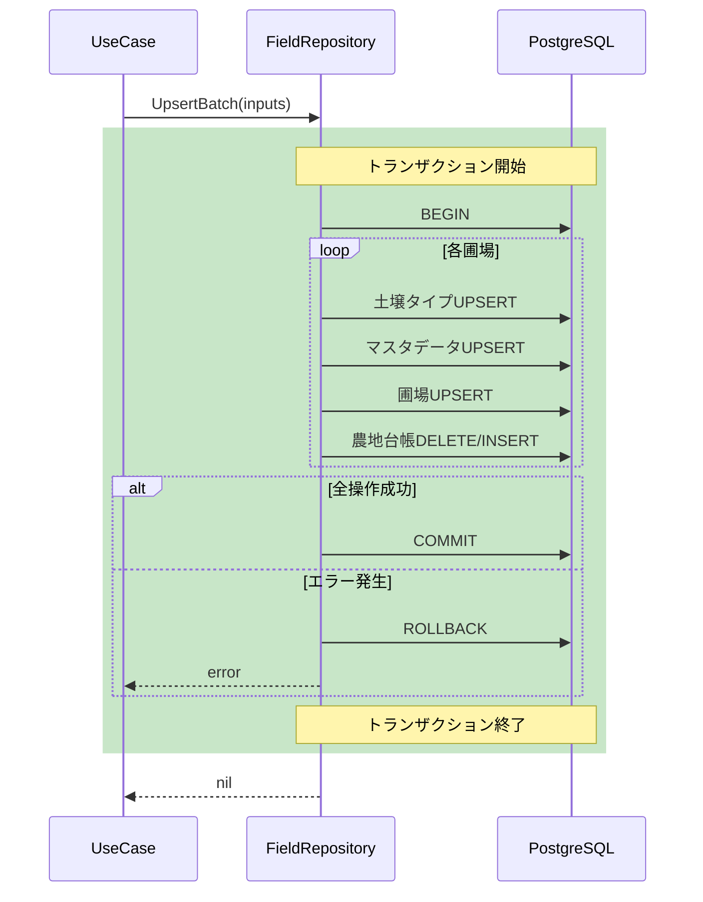

**特徴**:
- 1バッチ内の全圃場を1トランザクションで処理
- バッチ失敗時は該当バッチのみロールバック、他バッチの処理は継続
- 部分的成功を許容(partially_completed ステータス)

### クラスター結果保存(cluster_postgres.go:55-90)

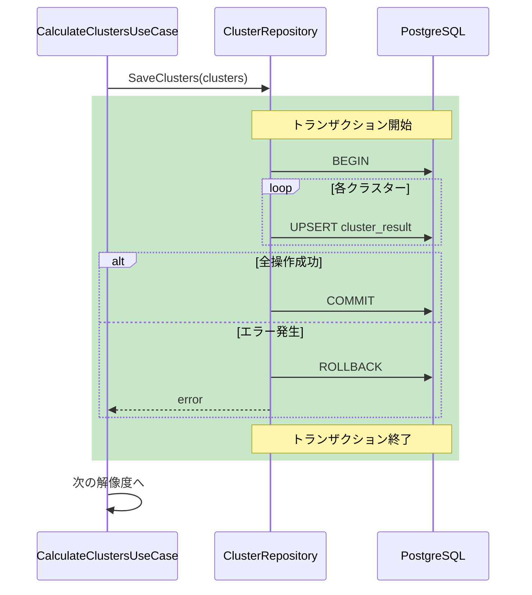

**特徴**:
- 1解像度の全クラスター結果を1トランザクションで保存
- 解像度ごとに独立したトランザクション
- 途中の解像度で失敗した場合、それ以前の解像度の結果は保持される

### インポート処理全体のトランザクション設計

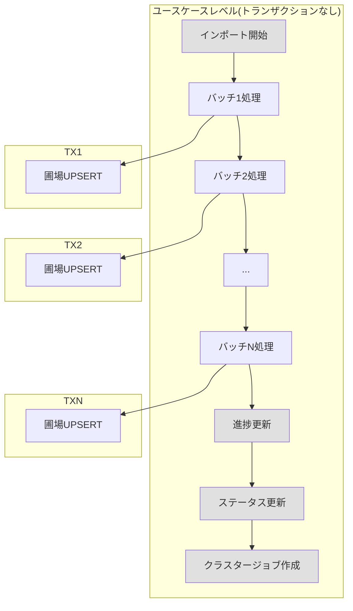

**設計理由**:
- 大量データ処理時のメモリ効率とリカバリ性を優先
- バッチ単位での部分的成功を許容
- 失敗バッチのリトライが可能な設計

### エラー発生時のデータ整合性

| シナリオ | 影響範囲 | リカバリ方法 |
|---------|---------|------------|
| バッチ処理中にDB接続断 | 該当バッチのみ未反映 | ジョブ再実行(べき等性あり) |
| クラスター計算中に障害 | 一部解像度のみ更新 | 手動再計算API実行 |
| キャッシュ削除失敗 | キャッシュと実データの不整合 | TTL経過で自動解消 or 手動再計算 |

## データベーステーブル

### 関連テーブル構成

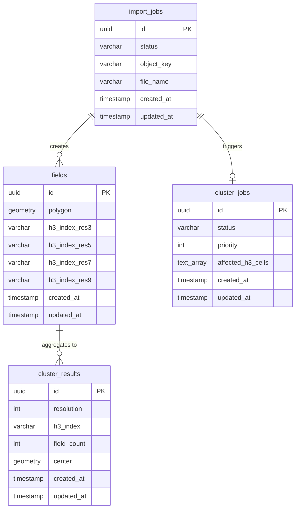

## ワーカーの動作モード

### import-processor / cluster-worker 共通

| 環境変数 | デフォルト | 説明 |
|---------|-----------|------|
| `RUN_ONCE` | `false` | `true`: 1回実行して終了(Lambda/K8s Job向け) |
| `BATCH_SIZE` | `10` | 1回のポーリングで処理するジョブ数 |
| `POLL_INTERVAL` | `60s` | ポーリング間隔(デーモンモード時) |

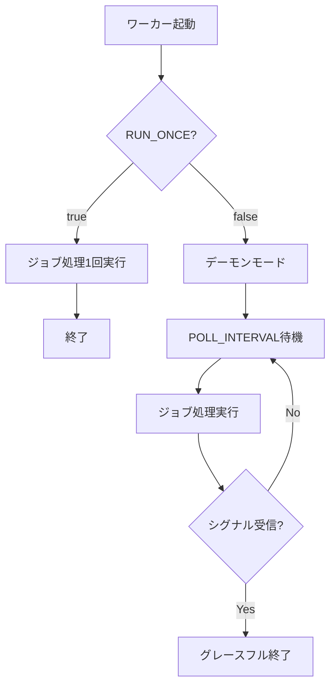

## 手動再計算API

インポートとは別に、管理者が手動で全範囲再計算を実行できる。

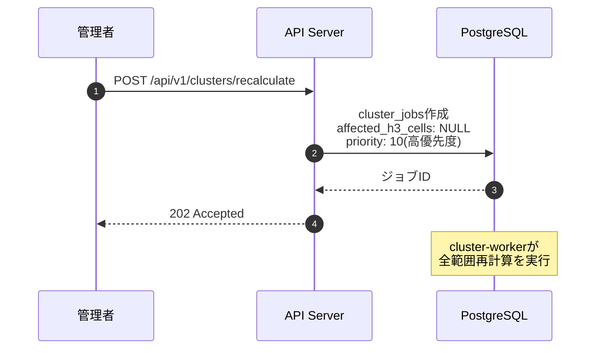
